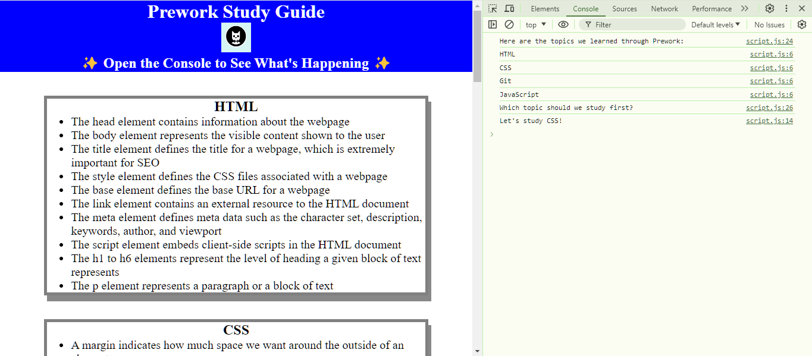

# Prework Study Guide

## Description

This is a prework study guide that I have created for my coding bootcamp. This was my first coding project that I've done. I was a total rookie to coding when starting the bootcamp, and these notes have been a great study resource. This study guide will contain notes on HTML, CSS, Git, and JavaScript.

## Installation

N/A

## Usage

To use the prework study guide, start by opening the console in the webpage. This will give you a random selection for what topic to study first! These topics include HTML,CSS,Git and JavaScript. 

## Credits

N/A

## License

Please refer to the lisence listed in the repo.
